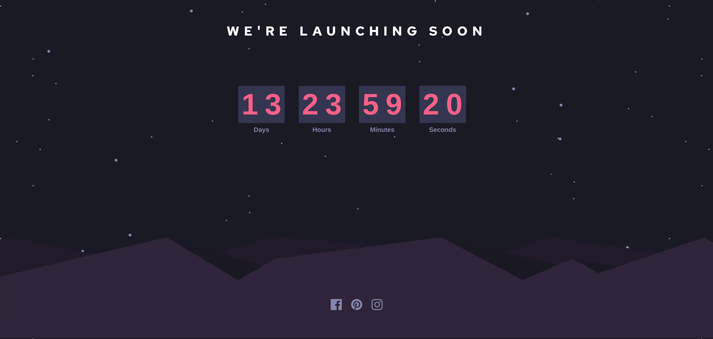

# Frontend Mentor - Launch countdown timer solution

This is a solution to the [Launch countdown timer challenge on Frontend Mentor](https://www.frontendmentor.io/challenges/launch-countdown-timer-N0XkGfyz-). Frontend Mentor challenges help you improve your coding skills by building realistic projects. 

## Table of contents

- [Overview](#overview)
  - [The challenge](#the-challenge)
  - [Screenshot](#screenshot)
  - [Links](#links)
- [My process](#my-process)
  - [Built with](#built-with)
  - [What I learned](#what-i-learned)
  - [Continued development](#continued-development)
  - [Useful resources](#useful-resources)

## Overview

### The challenge

Users should be able to:

- See hover states for all interactive elements on the page
- See a live countdown timer that ticks down every second (start the count at 14 days)
- **Bonus**: When a number changes, make the card flip from the middle

### Screenshot

### Links

- Live Site URL: [Github Pages](https://your-live-site-url.com)

## My process

### Built with

- FlipDown
- Flexbox
- CSS Grid

### What I learned

- Using 100vh is not interchangeable with 100%.
- Interval timers and Date objects have lots of quirks and many edge cases.  
- Embedding a SVG vs using a SVG as the source for an img tag can explain alignment issues.
- When embedded with SVG tag, the SVG has a hover effect.  When changed to img tag, the hover effect is gone.

### Continued development

- GSAP and the gsap.to() method is a good starting point for creating a flip animation.
- Take more care when styling to handle mobile.
- The bottom image crop doesn't match the mobile design. translate? 
- Make the tiles look like design. 
     

### Useful resources

- [FlipDown](https://github.com/PButcher/flipdown#flipdown)
- [CSS Tricks](https://css-tricks.com/change-color-of-svg-on-hover/) - SVG vs IMG tag choice.
- [1st Web Designer](https://1stwebdesigner.com/9-free-open-source-flipping-clocks-using-css-javascript/) - 9 open source flipping clocks
- [Youtube Tutorial](https://www.youtube.com/watch?v=t56nSwjozf0) - Uses GSAP to create flip animation.
- [Stack Overflow](https://stackoverflow.com/questions/50176740/how-to-import-library-which-is-not-module-in-webpack) - Modules and Imports
